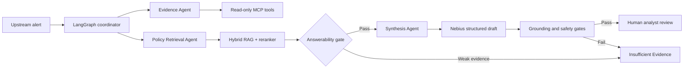

# Meridian — Payment Scam Review Copilot

Meridian helps financial-crime analysts assemble evidence-backed, policy-cited review briefs for
unusual customer-authorised payments, while keeping every decision and action with a human.

## Safety boundary

The copilot is decision support, not an autonomous fraud-decision system. It cannot freeze accounts, contact customers, move money, submit reports, or label a customer as fraudulent. Every investigation outcome requires human analyst review.

## MVP workflow

1. Validate a synthetic payment alert.
2. Gather account and transaction evidence through read-only tools.
3. Retrieve approved policy/SOP context through RAG.
4. Produce a cited investigation draft.
5. Enforce evidence, citation, PII, and prohibited-action gates.
6. Pause for an analyst to approve, edit, request more investigation, or escalate.

## End-to-end flow



The upstream monitoring system, rather than Meridian, creates the initial alert. Meridian is the
governed investigation and review-brief workflow that follows it.

## Architecture principles

- **LangGraph** manages typed state, routing, and checkpointed recovery; SQLite is the local MVP
  checkpointer and Postgres is the production replacement.
- **MCP** provides a controlled, read-only integration boundary: governed tools, immutable
  versioned policy resources, and constrained reusable analyst prompt templates.
- **RAG** retrieves only versioned, approved policy and procedure content.
- **LangSmith + structured logs** provide traceability and troubleshooting evidence.
- **Golden-case evaluations** block regressions before release.

## Design choices and trade-offs

| Decision | Why it was chosen | Trade-off / mitigation |
|---|---|---|
| Bounded LangGraph workflow instead of a free-form agent | Makes routing, state, failure handling and review points explicit. | Less open-ended autonomy; appropriate because payments decisions are consequential. |
| Three specialist roles with typed hand-offs | Separates evidence, policy retrieval and synthesis so each step is traceable. | They run in one process for MVP simplicity; contracts remain portable to distributed A2A services later. |
| Read-only MCP boundary | No tool can freeze an account, contact a customer, move money or submit a report. | It cannot complete action workflows; the analyst is deliberately the action owner. |
| Hybrid RAG and cross-encoder reranking | Combines semantic recall with keyword precision, then selects the most relevant approved procedures. | Adds latency; caching and a local retrieval fallback protect availability. |
| Nebius only drafts the narrative | Deterministic code retains authority over evidence, citations, confidence, gates and routing. | The narrative is less flexible; provider or grounding failure falls back safely. |
| SQLite locally, Postgres in production | Keeps the demo easy to run while retaining real checkpoint semantics. | SQLite is not the multi-user production store; the deployment path is documented. |

## Tools used

| Capability | Tooling |
|---|---|
| Orchestration and typed state | LangGraph, LangChain, Pydantic |
| Model and embeddings | Nebius Token Factory using Qwen models |
| Retrieval | Pinecone, versioned Markdown policy corpus, lexical retrieval, `cross-encoder/ms-marco-MiniLM-L-6-v2` |
| Governed integration | FastMCP resources, prompts and read-only tools; in-process MCP-style gateway on the MVP hot path |
| Analyst and operations surfaces | Streamlit and FastAPI |
| Observability | LangSmith traces, structured logs, Prometheus-compatible metrics |
| Evaluation | Pytest, deterministic workflow/RAG/conversation/safety suites, optional Nebius LLM quality judge |
| Persistence and memory | LangGraph SQLite checkpoints and SQLite case/audit store; Mem0 is an optional future preference layer |

## Repository layout

```text
src/copilot/       Application, workflow, retrieval, tools, guardrails, observability
tests/             Unit and workflow tests
data/fixtures/     Small committed synthetic alerts and transaction context
knowledge_base/    Fictional policy/SOP corpus used by RAG
evals/             Versioned workflow, RAG, conversation and safety evaluation cases
docs/              Architecture, decisions, runbook, and demo material
```

## Status

Core workflow, read-only local MCP tools, formal MCP resources and prompts, versioned policy retrieval, durable local checkpoints,
deterministic safety gates, bounded optional Nebius drafting, workflow golden cases, RAG retrieval
checks, safe provider fallbacks, and operational metrics are implemented. No real banking data is
used or accepted.

The committed synthetic evaluation corpus contains 20 labelled end-to-end alert scenarios, plus
separate RAG, multi-turn conversation and negative/safety evaluation sets. The latter verifies
safe routing for missing evidence, policy unavailability, prohibited actions, harmful output and PII.

## Hosted RAG (optional)

The 12-document fictional policy corpus can be embedded with Nebius `Qwen/Qwen3-Embedding-8B`
and retrieved from Pinecone. The `meridian-policy-rag-v1` index uses cosine similarity and its
4096-dimensional vectors. Meridian merges semantic Pinecone candidates with lexical candidates
from the versioned local corpus, then uses a local `cross-encoder/ms-marco-MiniLM-L-6-v2` reranker
to select the best four procedures. To enable it after the corpus has been ingested, set
`RAG_BACKEND=pinecone` in `.env`. The local versioned retriever remains the safe fallback if
Pinecone, embeddings, or the reranker are unavailable.

After adding or changing a fictional policy, sync the configured Pinecone namespace:

```bash
PYTHONPATH=src uv run python scripts/ingest_policy_corpus.py
```

## Optional IBM AMLSim preview

To broaden synthetic pattern testing, build an ignored local preview from a downloaded public IBM
AMLSim sample. It remains explicitly labelled as non-Australian synthetic simulation data:

```bash
PYTHONPATH=src uv run python scripts/build_ibm_amlsim_preview.py \
  --source /path/to/ibm_amlsim/sample/outputs/tx.csv
```

## Run locally

```bash
uv sync --all-groups
uv run uvicorn copilot.api:app --app-dir src --reload
# In another terminal
uv run streamlit run src/copilot/ui.py
```

The API provides `/health`, `/ready`, `/cases`, `/cases/{case_id}/investigate`, `/evals/golden`,
`/evals/rag`, `/evals/conversation`, `/evals/safety`, `/evals/experiments`, and `/metrics`.

## Quality and release checks

Run the local test suite before a change is accepted:

```bash
LIVE_MODEL_ENABLED=false RAG_BACKEND=local LANGSMITH_TRACING=false RERANKER_ENABLED=false \
  UV_CACHE_DIR=/private/tmp/payments_scam_uv_cache uv run pytest -p no:rerunfailures -q
```

The Operations tab can run deterministic workflow, retrieval, conversation and safety suites, save
a named baseline, and compare later runs category by category. The optional Nebius quality judge
scores groundedness, clarity and safe actionability; it is a supplementary evaluation signal, never
a runtime decision-maker.

For a containerised API build, use `docker build -t meridian-copilot .` and provide secrets only as
runtime environment variables. See [the runbook](docs/runbook.md), [architecture](docs/architecture.md),
[demo guide](docs/demo.md), and [stakeholder discussion guide](docs/interview_qa.md).

## Production-minded local stack

Run `docker compose up --build` to start the API, Streamlit UI, and Prometheus at ports 8000, 8501,
and 9090. The compose file is deliberately local-demo friendly. Enable API-key roles before any
shared deployment, and replace the local SQLite stores with managed Postgres before a real service
deployment.
