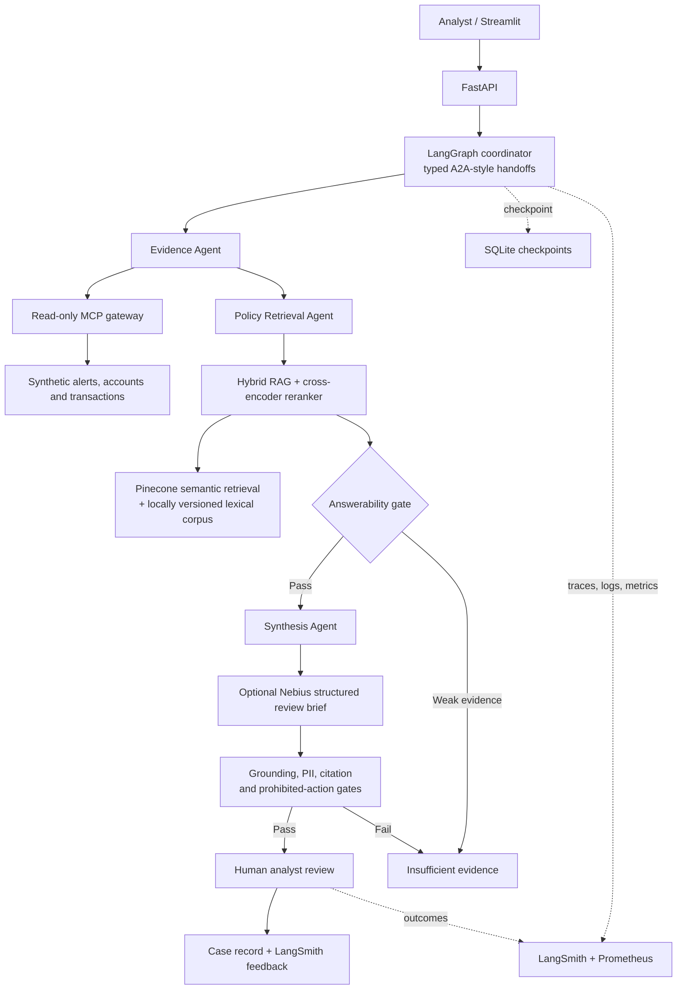

# Architecture decisions

## Scope

The MVP supports one scenario: an unusual customer-authorised outbound payment represented by synthetic data. It produces an analyst-facing investigation draft; it does not make or execute a fraud decision.

## Deliberate simplifications

- Three bounded roles: evidence collection, policy retrieval, and synthesis.
- Local fixtures and deterministic policy retrieval initially; public synthetic data and a vector store
  are introduced only after the workflow is tested.
- Typed in-process agent packets first; the message contracts remain portable to a formal A2A service later.
- A local MCP server exposes four read-only data tools, immutable versioned policy resources, and
  two constrained analyst prompt templates. The application uses the equivalent in-process gateway
  on its main path to avoid adding network latency to this bounded MVP.

## Memory model

| Need | Store | Authority |
|---|---|---|
| In-progress workflow | LangGraph SQLite checkpointer (MVP); Postgres in production | Operational state |
| Official case/audit history | Relational database | Source of truth |
| Approved policy knowledge | Vector store | Retrieval only |
| Analyst preferences | Mem0, later | Non-authoritative |

## Non-negotiable controls

All consequential actions are blocked. The system requires evidence and citations, represents missing evidence explicitly, and pauses for a human analyst before an outcome is recorded.

## Model fallback

Nebius is optional and is restricted to drafting the neutral summary. The deterministic workflow retains
control of evidence identifiers, policy citations, recommendation, confidence, gates, and routing. If the
model fails or its JSON is invalid, the deterministic draft is retained, the fallback is recorded, and an
analyst still reviews the case.

## Hosted RAG fallback

When `RAG_BACKEND=pinecone`, the policy retriever embeds a query through Nebius and queries the
synthetic approved-policy namespace in Pinecone. Similarity is converted to an explainable
high/moderate/low retrieval-confidence band; an unavailable embedding or vector service falls back
to the local versioned retriever. Neither confidence path bypasses gates or human review.
