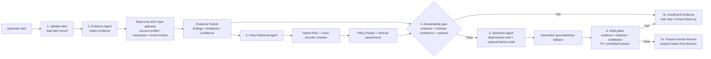

# Meridian — numbered workflow

This presentation view matches the implemented LangGraph sequence in `src/copilot/workflow.py`.

```mermaid
flowchart LR
    A[Upstream alert] --> B[1. Validate alert<br/>load alert record]

    B --> C[2. Evidence Agent<br/>collect evidence]
    C --> D[Read-only MCP-style gateway<br/>account profile • transaction • recent activity]
    D --> E[Evidence Packet<br/>findings • limitations • confidence]

    E --> F[3. Policy Retrieval Agent]
    F --> G[Hybrid RAG + cross-encoder reranker]
    G --> H[Policy Packet + retrieval assessment]

    E --> I{4. Answerability gate<br/>evidence + retrieval confidence + citations}
    H --> I

    I -->|Fail| N[7b. Insufficient Evidence<br/>safe stop / human follow-up]
    I -->|Pass| J[5. Synthesis Agent<br/>deterministic brief + optional Nebius draft]

    J --> K[Generation groundedness fallback]
    K --> L[6. Draft gates<br/>evidence • citations • confidence<br/>PII • prohibited actions]

    L -->|Pass| M[7a. Prepare Human Review<br/>analyst makes final decision]
    L -->|Fail| N
```

