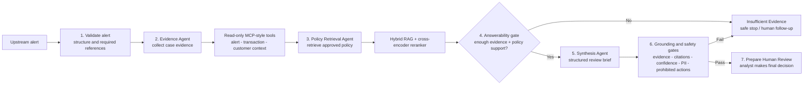

# Meridian - numbered workflow

This presentation view matches the implemented LangGraph sequence.

```mermaid
flowchart LR
    A[Upstream alert] --> B[1. Validate alert<br/>structure and required references]

    B --> C[2. Evidence Agent<br/>collect case evidence]
    C --> D[Read-only MCP-style tools<br/>alert - transaction - customer context]

    D --> E[3. Policy Retrieval Agent<br/>retrieve approved policy]
    E --> F[Hybrid RAG + cross-encoder reranker]

    F --> G{4. Answerability gate<br/>enough evidence + policy support?}

    G -->|No| H[Insufficient Evidence<br/>safe stop / human follow-up]
    G -->|Yes| I[5. Synthesis Agent<br/>structured review brief]

    I --> J[6. Grounding and safety gates<br/>evidence - citations - confidence - PII - prohibited actions]

    J -->|Pass| K[7. Prepare Human Review<br/>analyst makes final decision]
    J -->|Fail| H
```
